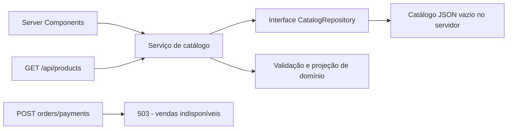

# Arquitetura da fundação

Escopo implementável: PRD v0.1 e foundation.spec. Não representa o sistema financeiro completo.

`src/domain` contém contratos e validação sem dependências de UI. `src/application` coordena casos de uso e projeções. `src/infrastructure` implementa leitura do JSON e marca a fronteira server-only. `src/app` contém páginas e adaptadores HTTP; `src/components` contém apresentação compartilhada. O domínio não importa Next.js.

Não há database, autenticação, pedido persistido, fila ou SDK financeiro nesta entrega. Não criar implementações falsas que pareçam confirmar pagamentos.
