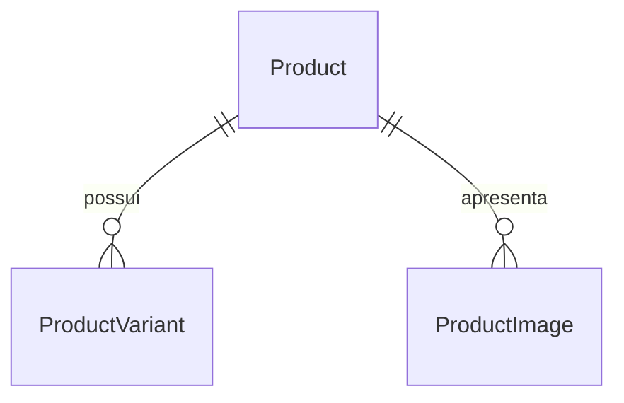

# Domínio inicial de camisaria

Confirmado: camisas são produtos físicos. Produto agrega variantes; SKU identifica uma combinação comercial de tamanho/cor, cujos valores reais serão fornecidos. Não fixar grade P/M/G ou cores predefinidas.

Product: id, slug, name, description, status draft/published, images, variants.
ProductImage: src local absoluto ao site, alt descritivo.
ProductVariant: id, sku, size, color, priceInCents (inteiro positivo seguro), stock (inteiro não negativo seguro).

Rascunhos podem ter listas vazias; publicados exigem imagem e variante. IDs de produto, slugs, IDs de variante e SKUs são únicos no catálogo. Projeção pública não inclui SKU, estoque exato ou dados internos; apenas disponibilidade e campos necessários à apresentação.

Sem banco nesta etapa: entidades são contratos validados. Pedido, reserva, endereço, pagamento e eventos não serão simulados. Modelagem transacional ficará pronta antes da implementação financeira.
