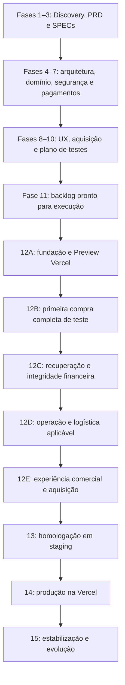

# SOLE — Roadmap de implementação por fases

Versão 0.1 · 29/09/2026 · Status: planejamento, execução não iniciada.

Atualização de execução, 29/09/2026: responsável confirmou camisaria física e solicitou preparar estrutura sem catálogo real e sem vendas. Foi especificado um recorte implementável em [PRD](01-product/PRD.md) e [SPEC de fundação](02-specs/foundation.spec.md), com documentação técnica própria. T07 foi concluída para esse recorte, com lint/tipos, 16 testes e build aprovados. Partes locais de T09/T10 estão prontas; CI remota, alertas externos, T08 (banco), integração financeira e deploy permanecem pendentes. O marco M0 do MVP completo não foi declarado concluído; o recorte atual não implementa suas funcionalidades comerciais. [Evidências de execução](13-quality/foundation-verification.md).

**CONFIRMED:** o deploy da aplicação será na Vercel, conforme instrução do responsável pelo projeto. Next.js, PostgreSQL, ORM e fornecedores complementares continuam candidatos até os ADRs correspondentes. Este roadmap antecipa o planejamento solicitado; não declara concluídas as fases documentais nem autoriza saltar seus critérios de entrada.

## 1. Resultado e caminho crítico

Entregar uma plataforma comercial com compra completa, pagamento confiável, operação mensurável e publicação recuperável na Vercel. Primeiro concluir as especificações; depois construir uma compra funcional de ponta a ponta, expandir sua cobertura e preparar o lançamento.

Cada entrega funcional inclui UI, servidor, persistência, eventos e testes pertinentes. A primeira compra de teste já inclui webhook e confirmação: pagamento não será uma integração deixada para o final.

## 2. Visão por fases e marcos

Os papéis abaixo indicam responsabilidade funcional, não contratação de pessoas ou execução por agentes separados. Datas e duração são `TO BE DEFINED Q-10`: dependem do catálogo, logística, equipe, orçamento e habilitação do Mercado Pago. A sequência é executável; ainda não é um compromisso de calendário.

| Fase | Objetivo e entregas | Dependências | Critério de saída / responsável |
| --- | --- | --- | --- |
| 1 — Discovery | Refinar os nove documentos; confirmar produto, público, preços e operação | Q-01 a Q-12 no registro de pendências | Hipóteses críticas resolvidas ou bloqueios explicitados por feature; Produto + negócio |
| 2 — Product | PRD, MVP, exclusões, objetivos e métricas | Fase 1 | Escopo viável com regras comerciais conhecidas; Produto |
| 3 — Specifications | SPEC por feature, estados de UI, Given/When/Then e regras | PRD | Requisitos rastreáveis e critérios testáveis; Produto + engenharia + QA |
| 4 — Architecture | Comparação técnica, arquitetura, APIs preliminares e ADRs; Vercel como destino confirmado | SPECs | Limites de runtime, banco, jobs, mídia, região e custo avaliados; Arquitetura |
| 5 — Domain | Entidades, ERD, invariantes, constraints e máquinas de estado | Arquitetura | Concorrência, idempotência e estados financeiros/operacionais formalizados; Engenharia |
| 6 — Security | Threat model, autorização, privacidade e controles por fronteira | Domínio e fluxos | Riscos críticos com mitigação e evidência exigida; Segurança |
| 7 — Payments | Modalidade Mercado Pago, checkout, webhooks, API e separação teste/produção | Fases 4–6; Q-04/Q-07 | Contratos oficiais atuais documentados; política de resultado desconhecido definida; Engenharia |
| 8 — UX/CRO | Fluxos mobile, design tokens, conteúdo, provas e protótipos | Catálogo, políticas e pagamentos definidos | Escolha, custo e próximos passos compreensíveis; UX + negócio |
| 9 — Analytics/SEO | Tracking, consentimento, deduplicação, métricas e indexação | Jornada e UX | Cada evento tem origem/destino; purchase vinculado à confirmação backend; Dados |
| 10 — QA | Estratégia, nove E2E obrigatórios, segurança, performance e rastreabilidade | SPECs e contratos consolidados | Critérios mensuráveis, fixtures e ambientes de teste planejados; QA |
| 11 — Plano executável | Refinar tasks deste roadmap, estimar e ordenar dependências | Fases 1–10 | Definition of Ready atendida por tarefa; Tech Lead |
| 12A — Fundação | Aplicação mínima, banco de teste, CI e Preview na Vercel | Marco M0 | Build reproduzível e ambientes isolados; Engenharia + DevOps |
| 12B — Compra vertical | Produto → carrinho → pedido → pagamento de teste → webhook → confirmação | 12A e SPECs prontas | Primeira compra aprovada ponta a ponta sem intervenção no banco; Engenharia + QA |
| 12C — Resiliência | Recusas, retries, concorrência, reconciliação e exceções financeiras | 12B | Falhas não duplicam efeitos nem perdem rastreabilidade; Engenharia + QA |
| 12D — Operação | Console restrito, fulfillment, suporte e políticas; logística condicional | 12C; Q-05/Q-06/Q-09 | Operador consegue atender pedido e resolver exceção; Operação + engenharia |
| 12E — Comercial | Home, catálogo completo, identidade, SEO e tracking | Fluxo funcional e materiais válidos | Jornada comercial completa em mobile; UX + engenharia + dados |
| 13 — Homologação | Regressão, carga, segurança, acessibilidade e ensaio de recuperação | 12A–12E | Sem falhas bloqueadoras; evidências e runbooks completos; QA + DevOps |
| 14 — Produção | Configuração final, migrations, build de produção, domínio e monitoramento | Marco M3 | Lançamento verificável e rollback disponível; DevOps + operação |
| 15 — Estabilização | Acompanhar pedidos, falhas, custos e métricas; corrigir desvios | Produção | Operação estável pelo período definido no plano de release; Produto + operação |

**M0 — Pronto para codificar:** documentação necessária completa, ADRs técnicos aceitos e DoR atendida. **M1 — Compra de teste:** conclusão de 12B. **M2 — MVP completo:** conclusão de 12E com resiliência e operação. **M3 — Pronto para publicar:** homologação, restore e configuração de produção verificados. **M4 — Produção estável:** período de observação concluído, responsável e evidências registrados.

## 3. Backlog inicial — EPIC → Feature → Story → Task

Cada linha é uma task dentro do épico e da feature indicados. Arquivos são caminhos **prováveis e futuros**, não arquivos já implementados. A estrutura será ajustada aos ADRs; caminhos com `db/` não pressupõem ORM escolhido. Toda conclusão também exige a Definition of Done da seção 7.

### EPIC E01 — Fundamentos documentados · Fases 1–11

Feature: contrato do produto. Story: como responsável pela SOLE, quero escopo e regras rastreáveis para construir uma operação coerente.

| Task / objetivo | Arquivos provavelmente afetados | Dependências | Critério de conclusão |
| --- | --- | --- | --- |
| T01 Resolver discovery e delimitar MVP | `docs/00-discovery/*`, `docs/01-product/PRD.md` | Respostas de negócio | Catálogo, público e limites do MVP registrados; dúvidas com impacto e responsável |
| T02 Especificar cada funcionalidade | `docs/02-specs/*` | T01 | Todas as seções exigidas, regras identificadas e aceite testável |
| T03 Formalizar arquitetura e dados | `docs/03-architecture/*`, `docs/03-architecture/adr/*`, `docs/04-domain/*` | T02 | ADRs, ERD, transições e constraints revisados; hospedagem Vercel registrada |
| T04 Definir segurança e integração financeira | `docs/07-security/*`, `docs/05-checkout/*`, `docs/06-integrations/*`, `docs/12-api/api-spec.md` | T03 e conta/métodos conhecidos | Contratos oficiais e ameaças cobertos; assinatura, retries e ambientes definidos |
| T05 Consolidar UX, mensuração e qualidade | `docs/08-growth/*`, `docs/09-analytics/*`, `docs/10-seo/*`, `docs/11-design/*`, `docs/13-quality/*` | T04 e materiais reais | Fluxos, métricas e plano de testes ligados às SPECs |
| T06 Fechar plano operacional e tasks executáveis | `docs/14-devops/*`, `docs/implementation-plan.md`, `CONTRIBUTING.md`, `SECURITY.md`, `CHANGELOG.md` | T05 | Ambientes, backup, release e incidentes documentados; M0 atendido |

### EPIC E02 — Fundação executável na Vercel · Fase 12A

Feature: ambiente reproduzível. Story: como desenvolvedor, quero validar cada mudança em ambiente isolado antes de publicar.

| Task / objetivo | Arquivos provavelmente afetados | Dependências | Critério de conclusão |
| --- | --- | --- | --- |
| T07 Inicializar aplicação e fronteiras | `package.json`, lockfile, `tsconfig.json`, `src/app/*`, `src/domain/*`, `src/application/*`, `src/infrastructure/*` | M0, ADR-001/007 | Instalação limpa, lint, tipos, teste inicial relevante e build aprovados |
| T08 Preparar banco e migrations iniciais | `db/schema/*`, `db/migrations/*`, `src/infrastructure/database/*`, `tests/integration/*` | T07, ADR-002 | Migração repetível em banco vazio, constraints testadas e conexão compatível com runtime |
| T09 Preparar configuração e entrega Vercel | `.env.example`, `.gitignore`, configuração de CI do provedor Git, `vercel.json` se necessário, `docs/14-devops/deployment.md` | T07/T08, acesso à conta e projeto | Preview isolada funcionando; nenhum segredo em Git ou bundle; gates impedem publicação prematura |
| T10 Instrumentar erros e health checks | `src/infrastructure/observability/*`, `src/app/api/health/*`, páginas de erro, `tests/integration/*` | T09 | Erros sanitizados com correlação; health check sem secrets; alerta de falha testado |

Configurações de conta e projeto Vercel serão registradas no runbook, mesmo quando feitas fora de arquivos. Escolher um mecanismo principal de deploy para evitar duas publicações concorrentes pelo Git e pela CI.

### EPIC E03 — Primeira compra completa · Fase 12B

Feature: transação vertical mínima. Story: como comprador, quero escolher um item, pagar e consultar a confirmação confiável.

| Task / objetivo | Arquivos provavelmente afetados | Dependências | Critério de conclusão |
| --- | --- | --- | --- |
| T11 Entregar produto e carrinho mínimos | `src/app/produto/[slug]/*`, `src/app/carrinho/*`, `src/application/catalog/*`, `src/application/cart/*`, testes correspondentes | T08/T10; SPECs produto/carrinho | Variante e quantidade válidas; preço vem do servidor; estado vazio/erro/loading coberto |
| T12 Criar checkout e pedido idempotente | `src/app/checkout/*`, `src/app/api/orders/*`, `src/domain/orders/*`, `src/application/checkout/*`, migrations e testes | T11; preço/logística definidos | Snapshot e total corretos; duplo clique/múltiplas abas não duplicam pedido; sessão autoriza consulta |
| T13 Integrar um método de teste ponta a ponta | `src/infrastructure/payments/*`, `src/application/payments/*`, `src/app/api/payments/*`, UI de pagamento e testes | T12; documentação oficial e credenciais de teste | Tentativa persistida, chave estável e tokenização conforme modalidade; dados de cartão não passam pelo backend SOLE |
| T14 Receber e processar webhook com confirmação | `src/app/api/webhooks/mercado-pago/*`, `src/application/payment-events/*`, `src/infrastructure/jobs/*`, migrations, `src/app/pedido/[id]/*` | T13; ADR-012 | Autenticidade, persistência, consulta ao provedor e transição transacional; M1 demonstrado |

O método inicial será escolhido pela estratégia oficial de testes e pelo MVP; não se presume que todos os métodos tenham o mesmo mecanismo de homologação. Caso haja produto físico, T12 inclui validação mínima de frete e estoque real de teste; sua expansão operacional ocorre em E05. A UI mínima já deve ser utilizável e acessível.

### EPIC E04 — Integridade e recuperação · Fase 12C

Feature: pagamento resiliente. Story: como comprador e operador, quero recuperar falhas sem cobranças duplicadas ou pedidos inconsistentes.

| Task / objetivo | Arquivos provavelmente afetados | Dependências | Critério de conclusão |
| --- | --- | --- | --- |
| T15 Tratar recusa, pendência e resultado desconhecido | Serviços e páginas de pagamento/pedido, `tests/e2e/payment-recovery*` | T14 | Refresh retoma pedido; timeout reconcilia mesma tentativa; recusa permite retry elegível |
| T16 Implementar fila durável e reconciliação | `src/infrastructure/jobs/*`, `src/application/reconciliation/*`, `db/migrations/*`, testes de integração | T14, ADR-012 | Duplicidade, desordem, interrupção e retry não duplicam efeitos; quarentena e reprocessamento auditados |
| T17 Completar métodos e exceções financeiras do MVP | Adaptador de pagamentos, domínio financeiro, testes e docs de integração | T15/T16; métodos e política comercial confirmados | Cada método testado; reembolso/contestação suportados ou reconciliados por rotina operacional especificada |
| T18 Validar concorrência de total, cupom e estoque | `src/domain/pricing/*`, `src/domain/inventory/*`, `tests/integration/*`, SPECs condicionais | T12/T16; Q-04/Q-05 | Adulteração rejeitada; última unidade não é vendida duas vezes; pagamento tardio recebe tratamento definido |

Cupom fora do escopo é explicitamente rejeitado; não implementar um motor promocional sem necessidade. Estoque físico é condicional ao modelo; se não se aplicar, registrar N/A com justificativa e verificar o mecanismo de disponibilidade correspondente.

### EPIC E05 — Operação comercial · Fase 12D

Feature: atendimento do pedido. Story: como operador autorizado, quero acompanhar pedidos e tratar exceções com rastreabilidade.

| Task / objetivo | Arquivos provavelmente afetados | Dependências | Critério de conclusão |
| --- | --- | --- | --- |
| T19 Entregar console e controle de acesso | `src/app/admin/*`, `src/application/admin/*`, autorização, audit log e testes | E04; ADR-004/011; Q-09 | Visualizar pagos, pendentes, recusas e webhooks falhos; ações autorizadas, MFA administrativo e auditoria |
| T20 Implementar entrega/disponibilização e catálogo operacional | Serviços de fulfillment/catálogo, adaptadores necessários, UI administrativa e testes | T19; tipo de produto e operação definidos | Operador processa um pedido até entrega/disponibilização; alterações de catálogo/estoque rastreáveis |
| T21 Entregar confirmação e suporte | Notificações transacionais, páginas de contato/políticas, testes | T19/T20; canal e políticas reais | Comunicação sem duplicidade; links de pedido autorizados; falha de notificação não desfaz pagamento |

### EPIC E06 — Experiência comercial e aquisição · Fase 12E

Feature: apresentação e mensuração da marca. Story: como visitante, quero entender a oferta e comprar com segurança em qualquer dispositivo.

| Task / objetivo | Arquivos provavelmente afetados | Dependências | Critério de conclusão |
| --- | --- | --- | --- |
| T22 Completar home, catálogo e identidade | `src/app/page.tsx`, `src/app/produtos/*`, componentes, tokens e ativos autorizados | E03/E05; design system e conteúdo | CTAs claros, informações reais, variantes e estados acessíveis; mobile/tablet/desktop revisados |
| T23 Implementar SEO e performance | Metadata, sitemap, robots, dados estruturados, componentes de imagem/fontes | T22; domínio definido | Páginas comerciais indexáveis; áreas privadas e previews não indexáveis; orçamento de performance atendido |
| T24 Implementar tracking com privacidade | Adaptadores de analytics, consentimento, outbox/eventos e testes | E04; plano de tracking | Purchase originado da confirmação; deduplicação por destino; nenhum dado pessoal indevido; testes não poluem produção |

### EPIC E07 — Homologação, lançamento e estabilidade · Fases 13–15

Feature: release recuperável. Story: como responsável pela operação, quero publicar uma versão comprovadamente funcional e responder a incidentes.

| Task / objetivo | Arquivos provavelmente afetados | Dependências | Critério de conclusão |
| --- | --- | --- | --- |
| T25 Homologar MVP em staging | `tests/e2e/*`, testes de carga/segurança, `docs/13-quality/*` | E02–E06 | Cenários da seção 6 passam com evidências; nenhuma falha crítica aberta |
| T26 Ensaiar restore, rollback e incidentes | `docs/14-devops/*`, scripts operacionais necessários, evidências sanitizadas | T25 | Restore em ambiente separado; versão anterior compatível; reconciliação retomada após interrupção |
| T27 Preparar e publicar produção Vercel | CI, configurações do projeto/domínio, migrations versionadas, runbook e changelog | M3; acessos e condições reais | Artefato correto, secrets corretos, webhook acessível, domínio/TLS e verificações pós-release concluídos |
| T28 Observar e estabilizar | Dashboards, alertas, runbooks, backlog de correções | T27 | Pedidos e pagamentos conciliados; responsáveis ativos; desvios classificados e tratados; M4 |

## 4. Plano específico para Vercel

### Ambientes e isolamento

| Ambiente | Finalidade | Dados e credenciais | Estratégia proposta |
| --- | --- | --- | --- |
| Development | Trabalho local e testes rápidos | Dados sintéticos e credenciais de teste | Configuração local ignorada pelo Git; `.env.example` sem valores reais |
| Preview | Validar cada alteração | Banco isolado por branch quando viável; caso contrário testes serializados em banco não produtivo; nunca produção | Deploy por PR/branch; acesso protegido; nenhuma campanha ou envio real |
| Staging | Homologar Mercado Pago e release integrado | Banco e credenciais de teste próprios; endpoint estável | Ambiente customizado se disponível no plano; alternativa: projeto Vercel separado para homologação |
| Production | Atender compradores reais | Banco, mídia, credenciais e destinos de eventos de produção | Domínio oficial; release controlado, observabilidade e backup |

Vercel distingue Development, Preview e Production e oferece ambientes customizados conforme disponibilidade. A seleção da forma de staging será feita no ADR-005, considerando o plano contratado. [Ambientes Vercel](https://vercel.com/docs/deployments/environments).

Variáveis devem ser configuradas por ambiente, separando identificadores públicos de segredos exclusivos do servidor. Incluir validação de configuração para impedir combinação de modo de teste com recursos produtivos. Não inferir ambiente financeiro somente por `NODE_ENV`. Alterações de variáveis devem entrar em novo deployment e ser verificadas nele. [Variáveis de ambiente](https://vercel.com/docs/environment-variables).

### Banco, runtime e tarefas duráveis

Proposta: aplicação e APIs na Vercel; PostgreSQL gerenciado fora do filesystem da função; região próxima ao runtime, conexão com pooling e orçamento de conexões validado em carga. Provedor de banco ainda não foi escolhido. O guia oficial trata pooling para funções; a configuração concreta dependerá do driver e do provedor. [Connection pooling](https://examples.vercel.com/kb/guide/connection-pooling-with-functions).

Não persistir pedidos, reservas, locks ou eventos apenas em memória ou disco local. Definir timeout de chamadas externas, tamanho máximo de payload e lotes de processamento compatíveis com o plano. Conferir limites reais antes de configurar funções; não presumir que aumento de duração substitui processamento durável. [Limites das Functions](https://vercel.com/docs/functions/limitations).

ADR-012 comparará processamento durável gerenciado com inbox/outbox e consumidores agendados. Requisitos mínimos: retry, deduplicação, leases recuperáveis, quarentena, observabilidade e reprocessamento. Agendador dispara trabalho; banco/fila persistem seu estado. Nenhum pagamento depende de uma promessa em memória terminar após a resposta HTTP.

### Webhook em ambiente protegido

Staging precisa de URL estável acessível ao Mercado Pago, sem exigir login interativo da Vercel. Avaliar as opções de proteção e exceção disponíveis no plano e testar com uma notificação real de teste; não presumir que o provedor consegue enviar headers extras. Uma exceção de plataforma não substitui validação de assinatura e autorização na aplicação. Manter o restante do ambiente protegido e não expor tokens de bypass em logs ou URLs compartilhadas. [Métodos de acesso a deployments protegidos](https://vercel.com/docs/deployment-protection/methods-to-bypass-deployment-protection).

### Pipeline proposto

1. PR: instalar pelo lockfile → lint → typecheck → unitários → integração com banco de teste → build → verificação de dependências e secrets.
2. Preview Vercel: validar carregamento, APIs e fluxos compatíveis com ambiente efêmero; nenhuma credencial de produção em execução de PR não confiável.
3. Staging: executar regressão E2E e integração Mercado Pago no endpoint estável, guardando commit e evidências.
4. Release: fixar commit, executar migration compatível uma única vez em job controlado e verificar o resultado. Nunca executar migration produtiva em todo build de Preview.
5. Criar build com configuração **de produção**, sem atribuição automática do domínio, e executar verificações sem efeitos financeiros; proteger o deployment ainda não publicado.
6. Promover o deployment de produção preparado após os gates. Verificar domínio, TLS, checkout, webhook, alertas e versão efetivamente servida.
7. Observar erros, pagamentos pendentes e fila. Acionar rollback ou contenção conforme critérios abaixo.

A Vercel diferencia promoção de Preview, que envolve rebuild para produção, de promoção de um build já preparado para produção, sem rebuild. Não transportar credenciais de teste junto com um artefato de Preview nem presumir que mudar o domínio troca variáveis embutidas. [Promoção de deployments](https://vercel.com/docs/deployments/promoting-a-deployment).

Staging de homologação com dados de teste e deployment de produção ainda sem domínio são etapas distintas. Este último tem acesso a recursos reais: não executar E2E destrutivo nem criar cobrança automática nele.

### Rollback, migrações e contenção

Usar migrations expand/contract: primeiro mudanças compatíveis, depois aplicação e backfill controlado; remoções só em release posterior. Restaurar a aplicação anterior não restaura o banco e não desfaz cobranças. Antes de publicar, comprovar compatibilidade da versão anterior com o schema atual.

Falhas de integridade financeira, exposição de dados ou indisponibilidade do checkout bloqueiam release. Após publicação, devem disparar contenção: interromper novas cobranças quando necessário, manter recebimento/reconciliação de eventos e avaliar rollback da aplicação. Não apagar pedidos ou eventos para “voltar ao estado anterior”.

Definir em T06 RPO, RTO, frequência e retenção de backups conforme negócio/provedor; demonstrar restore em T26. Registrar alerta, responsável, horário, versão, causa e reconciliação pós-incidente.

## 5. Dependências externas e decisões condicionais

| Dependência | Necessária até | Efeito de ausência |
| --- | --- | --- |
| Produto, catálogo e variantes — Q-01 | PRD/SPECs | Não fechar escopo de domínio e checkout |
| Preços, promoção e entrega — Q-04/Q-05 | SPECs financeiras | Não implementar cálculo ou estoque com regra inventada |
| Materiais de marca e provas — Q-03 | UX e E06 | Não finalizar identidade ou publicar promessas |
| Conta Mercado Pago, métodos e condições — Q-07 | Payments / T13 | Documentar propostas, mas não declarar integração homologada |
| Responsáveis e políticas — Q-06/Q-09/Q-12 | Operação e homologação | Impede lançamento comercial |
| Conta/equipe Vercel, plano, Git e domínio — Q-10/Q-11/Q-13 | Arquitetura operacional / T09 / T27 | Impede provisionamento ou publicação, não o planejamento |

Os IDs de negócio vêm de [open-questions.md](00-discovery/open-questions.md). Q-13 registra apenas acessos e recursos Vercel, pois o destino do deploy já está confirmado. Não solicitar segredos pelo chat.

Para produto físico: estoque, frete, reserva, expiração e pagamento tardio entram no MVP. Para produto digital/serviço: especificar entrega ou acesso e disponibilidade correspondentes. Boleto, cupons, ERP, conta de cliente e painel completo só entram se o PRD justificar; segurança operacional não pode ser adiada junto com o painel.

## 6. Evidências obrigatórias de homologação

| Cenário | Resultado exigido |
| --- | --- |
| Produto → carrinho → checkout → pagamento aprovado | Um pedido, uma cobrança efetiva, confirmação backend e consulta autorizada |
| Pagamento recusado | Mensagem útil, pedido recuperável e nenhuma confirmação indevida |
| Webhook duplicado | Nenhum novo pedido, efeito financeiro, baixa ou conversão duplicada |
| Refresh durante pagamento | Retoma o mesmo pedido e reconcilia resultado |
| Adulteração de preço | Servidor rejeita ou recalcula por regra explícita; nunca cobra valor adulterado |
| Produto sem estoque | Cobrança impedida; caso não aplicável, registrar justificativa e teste de disponibilidade equivalente |
| Cupom inválido | Erro claro e total consistente; se cupons excluídos, API rejeita tentativa |
| Indisponibilidade Mercado Pago | Resultado desconhecido rastreado, retry seguro e reconciliação |
| Frontend indica sucesso, backend pendente | UI continua pendente; sem purchase nem liberação indevida |

Adicionar concorrência pela última unidade, assinatura inválida, evento fora de ordem, IDOR, expiração de sessão, reembolso/contestação aplicáveis, fila interrompida, falha de notificação e restore. Testes devem verificar invariantes e resultados observáveis, não apenas espelhar funções.

Proposta de orçamento de experiência para especificação em T05: LCP ≤ 2,5 s, INP ≤ 200 ms e CLS ≤ 0,1 no percentil 75 de dados de campo quando houver amostra. Antes do lançamento usar cenários de laboratório explicitamente definidos; Lighthouse isolado não comprova resultados de campo. Validar fluxos em 360 px, tablet e desktop, teclado, leitor de tela e zoom; alvo de acessibilidade WCAG 2.2 AA a detalhar na SPEC, sem declarar conformidade antes da avaliação.

## 7. Regras de execução e acompanhamento

**Definition of Ready:** objetivo, SPEC, regras, aceite, UX, dependências, configuração de ambiente e revisão de segurança aplicável. Uma task com informação financeira crítica desconhecida fica bloqueada, mesmo que outras possam avançar.

**Definition of Done:** código implementado, tipos/lint/build aprovados, testes pertinentes, aceite atendido, responsividade e segurança verificadas, tracking aplicável e documentação atualizada. Tarefas documentais exigem revisão de consistência e links; não exigem aplicação inexistente.

Estados do backlog: Planejada → Pronta → Em execução → Em validação → Concluída, ou Bloqueada com motivo e responsável. Registrar por task: commit, SPEC, ambiente, resultado, evidência e risco restante. Hoje T01 está parcialmente atendida pelos documentos iniciais; T02–T28 não estão concluídas. Este roadmap não cria um percentual fictício de progresso.

Na fase 11, estimar tarefas em faixas de esforço, capacidade disponível e incerteza. Reestimar após M1, usando esforço real da primeira compra. Custos de Vercel, banco, mídia, jobs, observabilidade e taxas de pagamento serão separados. Não fixar prazo sem resolver Q-10.

## 8. Pós-MVP

Após M4 e com dados suficientes: priorizar redução de abandono, melhorias de aprovação e clareza comercial. Avaliar contas de cliente, favoritos, avaliações verificadas, recuperação consentida, fidelidade, automações e integrações ERP. Cada evolução repete o ciclo PRD/SPEC → ADR aplicável → implementação vertical → testes → release.

Fontes Vercel consultadas em 29/09/2026. Capacidades, disponibilidade por plano e limites devem ser reconferidos no provisionamento. Nenhum recurso externo foi criado e nenhum deploy foi executado nesta entrega.
