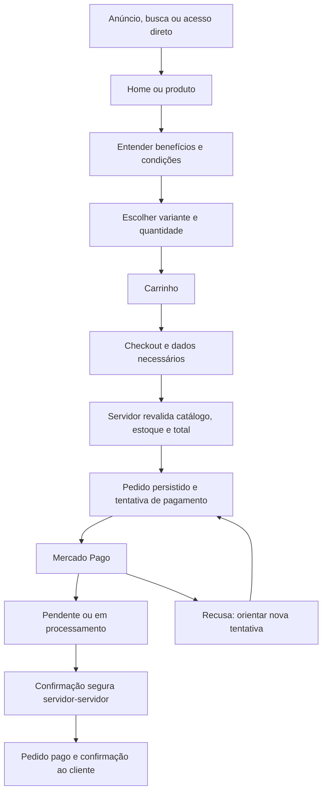
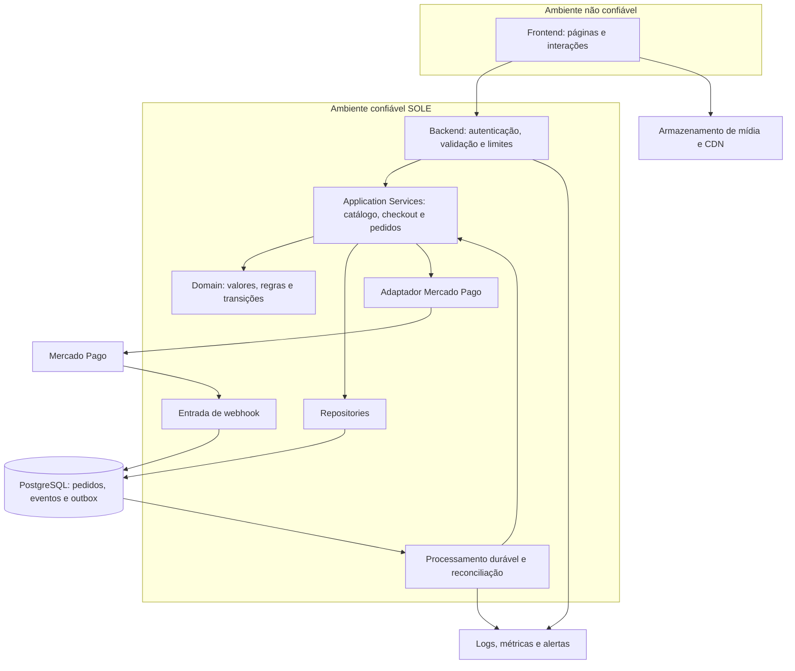

# SOLE — Product Discovery & Technical Planning

29/09/2026 · Primeira execução · Proposta v0.1

Atualização posterior: o responsável confirmou o deploy na Vercel. O [roadmap de implementação](implementation-plan.md) detalha fases, backlog, ambientes e publicação. O restante deste documento registra a proposta inicial e suas pendências.

## 1. Executive Summary

A SOLE será a presença comercial da marca, reunindo apresentação, catálogo, descoberta e compra com checkout próprio integrado ao Mercado Pago. O objetivo é permitir que visitantes entendam a oferta, escolham o produto e concluam a compra com clareza, enquanto a operação acompanha pedidos, pagamentos e o funil comercial.

O nome da marca não permite deduzir o segmento: não há confirmação de que venda calçados, roupas, produtos físicos ou digitais. Público, catálogo, preços, diferenciais, identidade visual e logística são `TO BE DEFINED`. Experiência premium é uma diretriz fornecida; posicionamento de preço premium não está confirmado.

Esta execução entrega planejamento inicial e inicia Discovery. Não cria site, banco, integração ou código de produção. Hipóteses estão no [registro de assumptions](00-discovery/assumptions.md).

## 2. Sitemap inicial

| Rota proposta | Objetivo primário | Condição |
| --- | --- | --- |
| `/` | Apresentar marca e conduzir à oferta relevante | MVP |
| `/produtos` | Encontrar um produto | MVP; filtros proporcionais ao catálogo |
| `/produto/[slug]` | Escolher variante e adicionar ao carrinho | MVP |
| `/carrinho` | Revisar itens e seguir ao checkout | MVP |
| `/checkout` | Informar dados necessários e pagar | MVP |
| `/pedido/[id]` | Consultar estado oficial e próximos passos | MVP; sessão autorizada, ID não é autorização |
| `/sucesso` | Exibir confirmação obtida do backend | Estado de apresentação, nunca prova de pagamento |
| `/pagamento-pendente` | Orientar espera ou ação necessária | Pode ser estado da página de pedido |
| `/pagamento-falhou` | Explicar recusa e permitir recuperação segura | Pode ser estado da página de pedido |
| `/politica-de-privacidade` | Explicar tratamento dos dados | Conteúdo depende da operação real |
| `/termos` | Informar condições da compra | Conteúdo a validar |
| `/trocas-e-devolucoes` | Reduzir dúvidas de pós-venda | Adaptar ao tipo de produto |
| `/contato` | Oferecer suporte identificável | Canal e responsável pendentes |
| `/admin` | Acompanhar operação mínima | Acesso restrito; desenho depende de Q-09 |

Navegação principal: marca → produtos → produto → carrinho. Políticas e contato no rodapé e nos pontos de decisão. Checkout e pedidos não devem ser indexados nem conter dados pessoais em URLs. Rotas de status separadas só serão mantidas se melhorarem a experiência; não devem criar três fontes de estado.

## 3. Jornada de compra

Antes de nova tentativa, reconciliar a anterior se seu resultado for desconhecido. Atualizar a página retoma o pedido existente. Webhook atrasado não transforma pagamento pendente em falha. Endereço, frete e estoque físico dependem do modelo comercial. Detalhes e fricções em [customer-journey.md](00-discovery/customer-journey.md).

## 4. MVP proposto

Essencial: home comercial, catálogo, produto com variantes quando existirem, carrinho, compra como visitante, checkout próprio, pedido persistente, pagamento Mercado Pago, webhooks verificáveis, idempotência, confirmação pelo servidor, recuperação de estados pendentes e visibilidade operacional.

Também fazem parte da entrega: políticas e contato reais, responsividade, acessibilidade, SEO comercial, tracking com privacidade, logs sanitizados, testes financeiros, ambientes separados, migrations, backups e procedimento de recuperação. Não são acabamento opcional.

`ASSUMPTION A-03`: Pix e cartão serão os métodos iniciais, sujeitos à conta, ao público e às condições comerciais. `ASSUMPTION A-04`: conta do comprador não será obrigatória. Frete, reserva de estoque e endereço tornam-se essenciais se o produto for físico. Cupons precisam de decisão de negócio: se não houver campanha inicial, propor adiamento e rejeitar códigos recebidos pela API, sem campo promocional ativo.

Pós-MVP proposto: contas e histórico do comprador, favoritos, avaliações verificadas, automações de recuperação consentidas, fidelidade, recomendações, relatórios avançados, ERP e administração ampliada.

Fora do MVP proposto: marketplace, split entre vendedores, assinaturas, múltiplas moedas, aplicativo nativo, motor próprio de antifraude e armazenamento de cartões. Se o modelo real exigir algo dessa lista, revisar escopo antes de escrever o PRD.

## 5. Arquitetura inicial proposta

### Comparação preliminar

Avaliação qualitativa da equipe, não benchmark nem cotação. Volumes e orçamento permanecem em aberto.

| Alternativa | Performance e SEO | Manutenção, DX e segurança | Escala, deploy e custo | Integração Mercado Pago |
| --- | --- | --- | --- | --- |
| Next.js + React + TypeScript, monólito modular | Renderização no servidor para páginas comerciais; JS limitado às interações | Uma base; exige disciplina nas fronteiras cliente/servidor e atualização de dependências | Implantação integrada candidata; custo depende de tráfego, imagens, banco e jobs | Adaptador backend próprio, isolado da UI |
| Frontend SSR e API Node separada | Controle de renderização equivalente conforme framework | Contratos explícitos; mais configuração, autenticação e observabilidade distribuída | Escala independente; dois serviços e maior esforço operacional inicial | Mesmo domínio de pagamentos, com comunicação entre serviços |
| Plataforma de comércio pronta com tema ou frontend próprio | Depende do tema e das APIs disponíveis | Reduz construção do backoffice; traz dependência de extensões e fornecedor | Custos de plataforma, extensões e manutenção precisam de cotação | Elegibilidade da integração e liberdade do checkout precisam ser comprovadas |

Recomendação preliminar: monólito modular Next.js/React/TypeScript em Node.js por unir páginas comerciais renderizadas no servidor e backend numa base. O App Router suporta composição de componentes de servidor e cliente; isso permite reservar interatividade para onde é necessária. [Documentação oficial Next.js](https://nextjs.org/docs/app/getting-started/server-and-client-components).

| Componente | Candidato e alternativa | Motivo / pendência |
| --- | --- | --- |
| Banco | PostgreSQL; alternativa documental | Proposta relacional para pedidos, tentativas e consistência transacional; validar operação e custos |
| Persistência | Prisma ou Drizzle; alternativa SQL parametrizado | Comparar migrations, transações, pooling, controle de SQL e manutenção antes do ADR-002 |
| Formulários | Zod + React Hook Form; alternativa validação explícita e formulários nativos | Proposta para contratos e feedback; servidor sempre revalida |
| Estilo | Tailwind CSS; alternativa CSS Modules | Escolher pela manutenção dos tokens e identidade própria; biblioteca não define marca |
| Hospedagem | Vercel, confirmada pelo responsável após a primeira entrega | Definir plano, duração de execução, jobs, região, conexão ao banco e custo total; não depender de tarefa em memória após resposta |
| Mídia | Armazenamento de objetos + CDN; alternativa serviço especializado | Exigir autorização de upload, formatos adequados e direitos das imagens; provedor pendente |
| Estado | Servidor para pedido/pagamento, estado local para UI | Carrinho exibido no cliente nunca fixa preço nem disponibilidade |

As setas representam fluxo operacional. O domínio não depende de SDK, framework ou banco; serviços usam interfaces implementadas pelos adaptadores. Serviços externos não são uma camada abaixo do banco.

Proposta de resiliência: pedido e intenção de pagamento persistidos antes da chamada externa; identificador idempotente estável por operação; evento recebido persistido antes do reconhecimento; processamento durável com tentativas limitadas, backoff, quarentena e reconciliação. Não presumir entrega exatamente uma vez: usar unicidade e transações para impedir efeitos duplicados. A consulta ao provedor validará vínculo ao pedido, conta recebedora, moeda e valor antes de alterar o estado.

### Comparação inicial de checkout

| Opção | UX e controle | Segurança e manutenção | Encaminhamento |
| --- | --- | --- | --- |
| Checkout próprio com componentes oficiais Bricks | Candidato para incorporar pagamento à experiência da SOLE | Avaliar tokenização, compatibilidade da API, acessibilidade e escopo PCI; componentes não eliminam obrigações | Prioridade de investigação |
| Checkout Transparente/API | Candidato quando o controle exigido não couber nos componentes | Mais responsabilidade por interface, validação, estados e manutenção | Comparar com Bricks antes da escolha |
| Checkout Pro | Fluxo de pagamento hospedado pelo provedor | Menor superfície própria de interface de pagamento; ainda exige pedidos e reconciliação seguros | Alternativa se o requisito de checkout próprio puder ser revisto |

Esta é uma avaliação de projeto. Não há evidência para afirmar que uma modalidade converte mais para a SOLE. Comparar no mobile os fluxos de Pix, cartão, recusa, retorno e retomada. Validar taxas e parcelamento com a conta comercial; não estimar percentuais sem contrato.

Consulta oficial em 29/09/2026: [Bricks](https://www.mercadopago.com.br/developers/pt/docs/checkout-bricks/overview), [Checkout API via Orders](https://www.mercadopago.com.br/developers/pt/docs/checkout-api-orders/overview) e [Checkout Pro via Orders](https://www.mercadopago.com.br/developers/pt/docs/checkout-pro-orders/create-order?scope=prod). O último documenta redirecionamento por `checkout_url`. A navegação oficial distingue famílias Orders e Preferences; não combinar contratos de famílias diferentes.

Limite da pesquisa: algumas páginas retornaram majoritariamente navegação, e a página geral de webhooks não expôs conteúdo técnico suficiente. Nenhum endpoint, esquema de assinatura, SDK ou mecanismo de testes está fechado nesta entrega. Na fase Payments, consultar a documentação específica da modalidade escolhida e registrar payloads, autenticação, idempotência, testes e evidências. Não avançar à implementação de pagamentos com lacunas nesses contratos.

## 6. Estrutura de documentação

O [inventário completo](README.md) apresenta todos os documentos previstos, distinguindo os criados dos planejados. Nesta execução são iniciados apenas os nove arquivos da Fase 1, além deste planejamento, do índice e do README da raiz.

## 7. Principais ADRs necessários

| ADR | Decisão e critério principal |
| --- | --- |
| 001 Framework | SSR, experiência da equipe, manutenção e superfície de segurança |
| 002 Banco e ORM | Consistência, transações, migrations e pooling |
| 003 Pagamentos | Modalidade, família de API, métodos e isolamento do provedor |
| 004 Autenticação | Guest checkout, acesso ao pedido e MFA administrativo |
| 005 Hospedagem | Região, limites, execução durável e custo total |
| 006 Estado | Separação entre UI, carrinho e estado oficial no servidor |
| 007 API | Contratos HTTP, validação, autorização e padrão de erro |
| 008 Observabilidade | Logs sanitizados, métricas, alertas e responsáveis |
| 009 Mídia | Armazenamento, otimização, upload e custo |
| 010 Checkout | Etapas, retomada e acessibilidade dos componentes |
| 011 Administração | Operação mínima segura versus painel completo |
| 012 Idempotência | Unicidade, inbox/outbox, jobs e reconciliação |
| 013 Estoque | Fonte, reserva, expiração e pagamento tardio; condicional |
| 014 Tracking | Consentimento, destinos, eventos de servidor e deduplicação |

Nenhum ADR foi aceito ou redigido antecipadamente. Alternativa inicial ao painel completo: console restrito com consulta de pedidos, pagamentos e falhas, mais procedimentos auditados para catálogo e estoque. Dashboard do provedor isoladamente não cobre os pedidos internos; alteração manual direta no banco não é solução operacional padrão.

## 8. Principais riscos

Comerciais: construir oferta inadequada por falta de catálogo e público; publicar promessa sem prova; conversão prejudicada por frete ou política desconhecida. Financeiros: cobrança duplicada, preço adulterado, pagamento tardio após expiração e reembolso não conciliado. Técnicos: webhook perdido, concorrência de estoque e jobs interrompidos. Segurança: acesso indevido a pedidos, segredos vazados e eventos falsos. Operação: pedidos pagos sem responsável por expedição ou atendimento.

O [registro de riscos](00-discovery/risks.md) contém probabilidade qualitativa, impacto, prevenção e evidência de validação. Probabilidades são hipóteses; ainda não há histórico da SOLE.

## 9. Questões em aberto

Somente informações externas: produto e catálogo, público e evidências, identidade visual e materiais, preços e promoções, logística, política de pós-venda, conta Mercado Pago e condições, responsáveis operacionais, orçamento/prazo/volume, dados e ferramentas existentes, privacidade e identidade jurídica. Perguntas identificadas, impacto e momento de decisão constam em [open-questions.md](00-discovery/open-questions.md). Escolher framework, ORM ou estratégia de cache é trabalho técnico, não uma pergunta transferida ao usuário.

## 10. Plano de execução

| Fase | Entrega | Critério para avançar |
| --- | --- | --- |
| 1 Discovery | Nove documentos, hipóteses e pendências | Modelo comercial conhecido; lacunas rastreadas e bloqueios explícitos |
| 2 Product | PRD com MVP, pós-MVP, requisitos e métricas | Escopo coerente com operação e objetivos |
| 3 Specifications | SPEC por feature | Regras, estados e critérios Given/When/Then verificáveis |
| 4 Architecture | Comparação, arquitetura, design e ADRs | Trade-offs registrados; decisões críticas fundamentadas |
| 5 Domain | Entidades, ERD, constraints e estados | Invariantes financeiros, concorrência e transições definidos |
| 6 Security | Threat model, privacidade e controles | Riscos críticos com mitigação e teste planejados |
| 7 Payments | Mercado Pago, checkout, webhooks e API | Documentação específica atual consultada; contratos e ambientes definidos |
| 8 UX/CRO | Fluxos, copy briefs e design system | Compra mobile clara; promessas com evidência |
| 9 Analytics/SEO | Eventos, consentimento, métricas e SEO | Fontes de verdade e deduplicação especificadas |
| 10 QA | Estratégia, cenários e checklist | Nove E2E obrigatórios e matriz de rastreabilidade definidos |
| 11 Implementation Plan | Backlog EPIC → Feature → Story → Task | Cada task com objetivo, arquivos, dependências e critério de conclusão |
| 12 Development | Slices verticais | Definition of Ready atendida antes de cada slice |
| Validação | Evidências funcionais, financeiras, visuais e operacionais | Definition of Done atendida; falhas críticas resolvidas |
| Deploy | CI/CD, migrations, backup, restore e runbooks | Ambientes e credenciais corretos; recuperação demonstrada |

Ordem proposta de slices, a detalhar somente na fase 11: produto → carrinho → pedido → pagamento de teste → webhook → confirmação; depois recuperação/recusa, operação, logística aplicável, páginas comerciais e aquisição. Não entregar todo o frontend antes da integração.

Definition of Ready: objetivo, SPEC, regras, aceite, UX, dependências e revisão de segurança aplicável. Definition of Done: implementação, tipos, lint, testes, aceite, responsividade, segurança, analytics aplicável e documentação atualizada. Hoje não há feature que possa ser declarada Done.
